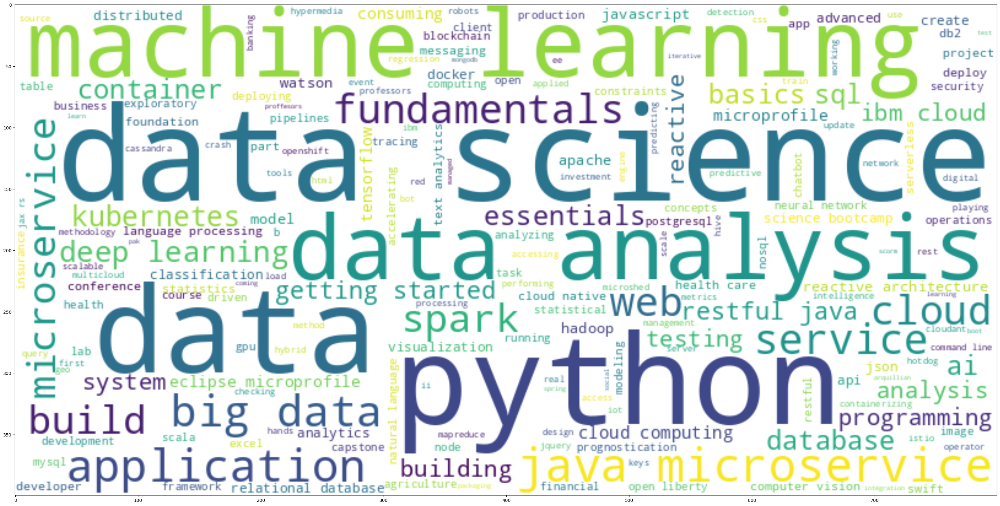
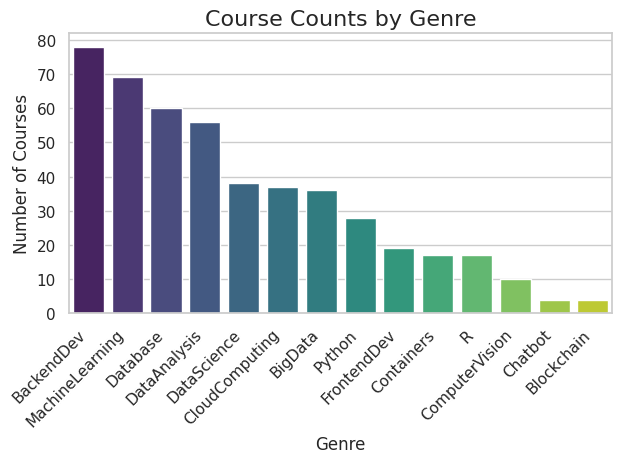
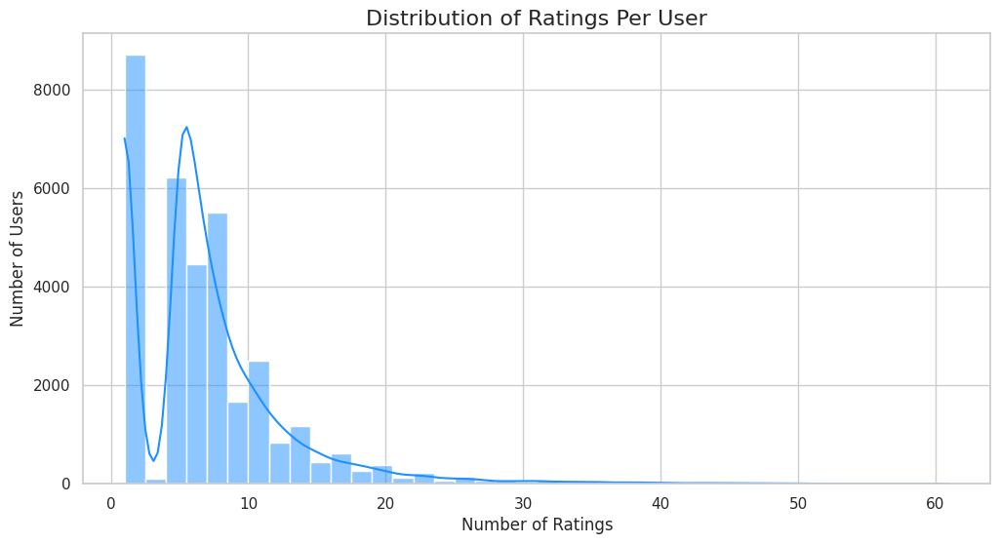
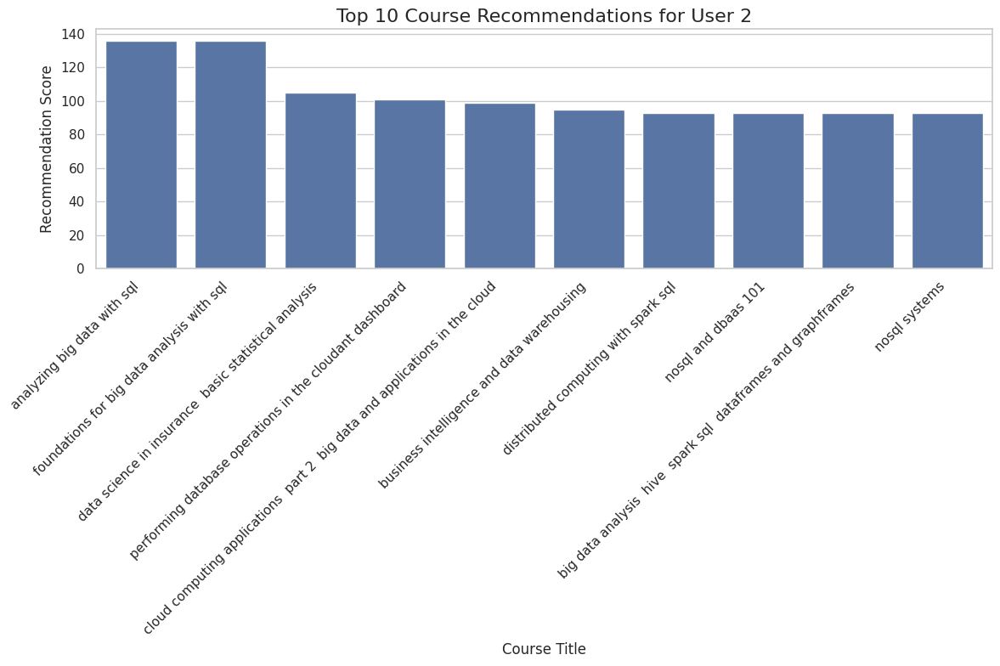
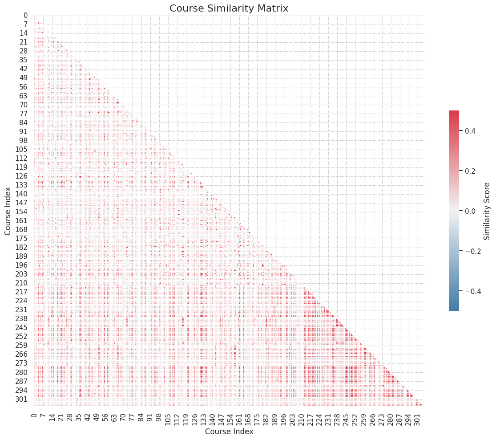
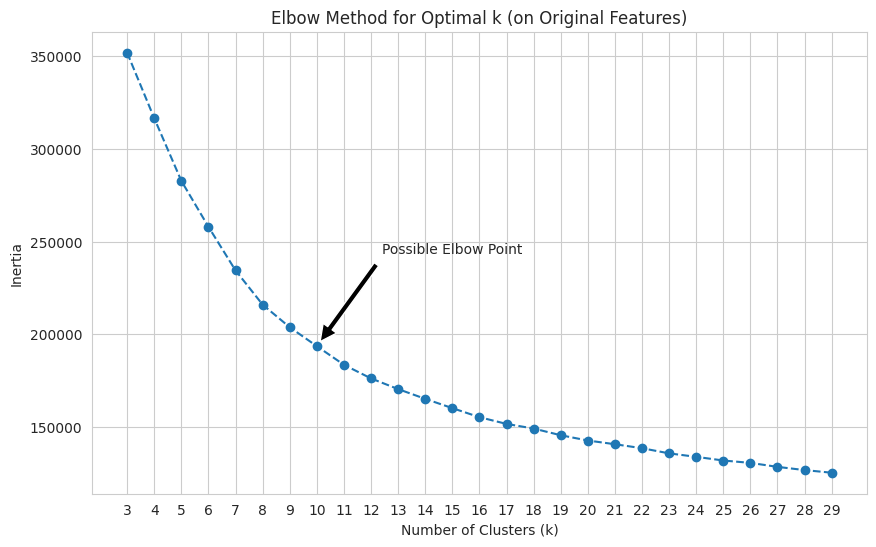
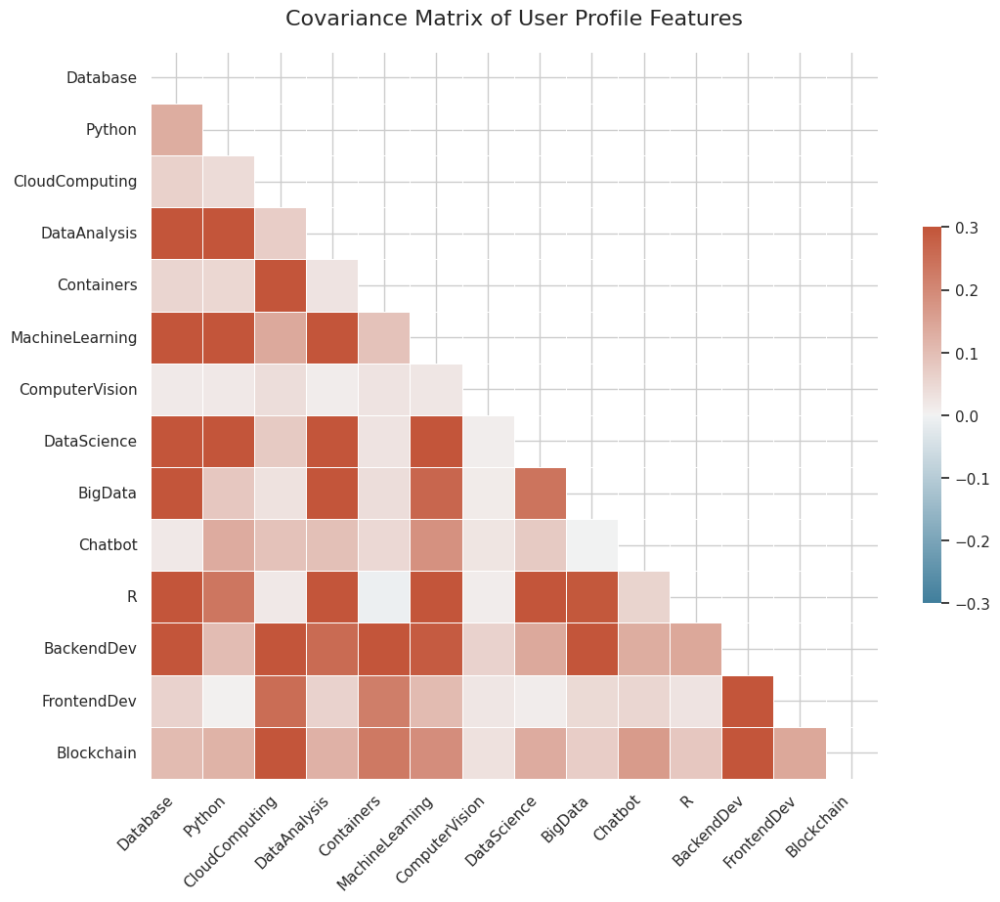
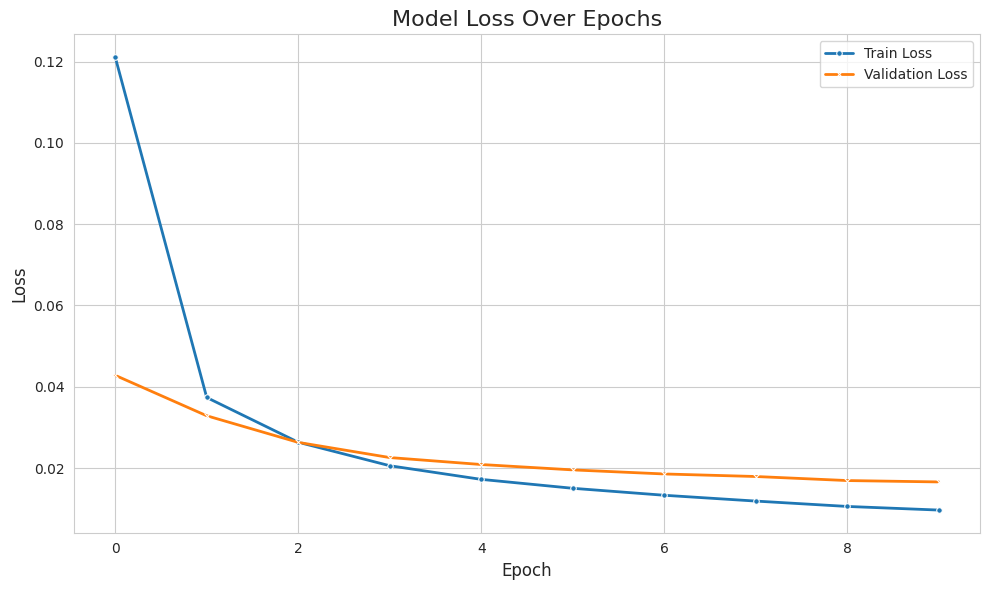

## Project Instructions

### Suggested Outline

This is a generic outline that you may follow, but by no means be forces to follow it completly. Use it more as a guideline

1. Cover Page
2. Executive Summary
3. Table of Contents
4. Introduction
5. Methodology
6. Results
7. Discussion
8. Conclusion
9. Appendix

### Final Submission Overview and Instructions

#### Capstone Project: Final Task

The final task of this capstone project is to create a presentation based on the
outcomes of all tasks in previous modules and labs.
Your presentation will develop into a story of all your machine learning journey in this project, and it should be compelling and easy to understand.

In the next exercise, you can find a provided PowerPoint template to help you get started to
create a report in slides format. There are placeholders in the template for each of the required elements of the project,
and that instructions are provided on each slide. You need to delete and replace the placeholders with the actual content.
However, you are encouraged to add additional elements such as slides, charts, and tables.

There are a total of 70 points possible points for the final assessment,
and you will be graded by your peers, who are also completing this assignment.

The main grading criteria will be:

- Uploaded your completed presentation in PDF format (2 pts)
- Completed the required Introduction slide (4 pt)
- Completed the required Exploratory Data Analysis slides (8 pts)
- Completed the required content-based recommender system using user profile and course genres slides (6 pts)
- Completed the required content-based recommender system using course similarity slides (6 pts)
- Completed the required content-based recommender system using user profile clustering slides (6 pts)
- Completed the required KNN-based collaborative filtering slide (6 pts)
- Completed the required NMF-based collaborative filtering slide (6 pts)
- Completed the required neural network embedding based collaborative filtering slide (6 pts)
- Completed the required collaborative filtering algorithms evaluation slides (6 pts)
- Completed the required Conclusion slide (6 pts)
- Applied your creativity to improve the presentation beyond the template (4 pts)
- Displayed any innovative insights (4 pts)

You may find more instructions in the PPT template. Also, you will
not be judged on your English language, including spelling, or grammatical mistakes.

## Project Content

### Introduction

- **Project Goal:** To develop a robust course recommendation system for an online learning platform.
- **Motivation:** Enhance user engagement and learning paths by providing personalized course suggestions.
- **Methodology Overview:** This report details the process of building a recommendation engine, covering data analysis, feature engineering, and the implementation and evaluation of various recommendation algorithms, including content-based filtering, collaborative filtering (KNN, NMF, and neural network embeddings), and hybrid approaches.

- **Target Audience:** This report is intended for stakeholders, data scientists, and product managers interested in understanding the development and performance of the course recommendation system.

- **Key Findings:**
    - Initial exploratory data analysis revealed key insights into course popularity, genre distribution, and user enrollment patterns.
    - Feature engineering, particularly the Bag of Words model, proved effective in transforming textual data for machine learning.
    - Both content-based and collaborative filtering methods demonstrated promising results in generating relevant course recommendations.
    - Hybrid approaches and dimensionality reduction techniques (PCA, NMF) enhanced the system's accuracy and scalability.

- **Report Structure:** This report is organized into the following sections:
    - **Introduction:** Provides an overview of the project, its goals, and the methodology.
    - **Exploratory Data Analysis:** Presents insights gained from initial data exploration.
    - **Feature Engineering:** Details the process of preparing data for model training.
    - **Recommendation System Implementations:** Describes the various recommendation algorithms used and their results.
    - **Evaluation:** Compares the performance of different recommendation approaches.
    - **Conclusion:** Summarizes the project's outcomes and discusses future work.

### Exploratory Data Analysis

#### Course Titles and Genres

- **Keyword Analysis:** A word cloud generated from course titles reveals that the courses are heavily focused on popular IT skills. Prominent keywords include: `Python`, `data science`, `machine learning`, `big data`, `AI`, `TensorFlow`, `cloud`, and `containers`.
  - **Note:** Include the word cloud image. 
- **Genre Distribution:** An analysis of course genres shows that `BackendDev`, `MachineLearning`, `Database`, and `DataAnalysis` are the most frequent categories.
  - **Note:** Include the bar chart of course genre counts. 

#### Course Enrollments

- **User Enrollment Statistics:**
  - The dataset contains **233,306** total enrollments from **33,901** unique users.
  - On average, a user is enrolled in approximately **7** courses, with a maximum of **61** courses.
- **Top Courses:**
  - The top 20 most popular courses account for over **63%** of all enrollments, indicating a high concentration of interest in a small subset of courses.
  - The most popular course is `Introduction to Python` with over 15,000 enrollments.
  - **Note:** Include the histogram of user enrollment distribution 

#### Feature Engineering (Bag of Words)

- To prepare the course text data for machine learning, Bag of Words (BoW) features were extracted from the course titles and descriptions.
- The process involved:
  1.  **Tokenization:** Splitting the text into individual words (tokens).
  2.  **Stop Word Removal:** Filtering out common, non-informative words (e.g., "the", "is", "a").
  3.  **Part-of-Speech (POS) Tagging:** Identifying and keeping only nouns to reduce dimensionality and focus on key concepts.
- The result is a BoW dataset where each course is represented by a vector of token counts.

#### Course Similarity

- **Cosine Similarity:** Using the BoW feature vectors, the cosine similarity was calculated to measure the likeness between courses.
- **Example:** The notebook demonstrates finding courses similar to "Machine Learning with Python" by comparing their BoW vectors and identifying those with a high cosine similarity score. This forms the basis for a content-based recommender system.

### content-based recommender system using user profile and course genres

- **Methodology:**
    - User profiles are generated by creating a weighted genre vector. This vector is calculated by multiplying a user's course ratings with the genre vectors of the courses they have rated.
    - Recommendation scores are computed by taking the dot product of a user's profile vector and the genre vector of a course they have not yet taken.
- **Results:**
    - The system successfully generates personalized course recommendations.
    - For example, a user with a strong interest in `Python` and `Machine Learning` receives recommendations for courses like `Python 101` and `Machine Learning with R`.
    - The notebook demonstrates this process with a test user, showing how to identify unknown courses and rank them based on the calculated recommendation scores.
- **Visualizations:**
    - **Note:** A chart showing the top recommended courses for a sample user could be beneficial. 

### content-based recommender system using course similarity

- **Methodology:**
    - A course-to-course similarity matrix is computed using the Bag of Words (BoW) features of each course. The similarity score ranges from 0 to 1, where 1 indicates a perfect match.
    - To recommend courses, the system takes a user's list of enrolled courses and a similarity threshold (e.g., > 0.6) as input.
    - It iterates through each enrolled course and, using the similarity matrix, finds other courses that have a similarity score above the defined threshold.
    - The system aggregates all unique, similar courses that the user has not already taken and sorts them by their similarity score to generate a ranked list of recommendations.
- **Results:**
    - The system effectively recommends new courses based on a user's enrollment history. For instance, if a user is enrolled in machine learning courses, the recommender suggests other relevant courses in data science, deep learning, and Python.
    - The notebook provides a concrete example where, given a set of enrolled courses, the system identifies and ranks 20 new courses with a similarity greater than 0.6.
- **Visualizations:**
    - A heatmap of the course similarity matrix visually confirms that many courses are highly similar, making this approach viable.
    - **Note:** Include the similarity matrix heatmap. 

### content-based recommender system using user profile clustering

- **Methodology:**
    - This approach groups users with similar interests into clusters and then recommends popular courses from within those clusters. Two methods were tested:
        1.  **Clustering on Original Features:** K-Means clustering was applied directly to the 14 standardized user-profile features. The elbow method was used to determine the optimal number of clusters, which was found to be **10**.
        2.  **Clustering on PCA-Reduced Features:** To improve efficiency, Principal Component Analysis (PCA) was first used to reduce the dimensionality of the feature space. It was found that **9 principal components** could explain over **90%** of the data's variance. K-Means was then applied to these 9 components, with the optimal cluster count determined to be **20**.
    - For a given user, the system identifies their cluster and recommends the most frequently enrolled courses by other users in the same cluster, excluding courses the user has already taken.
- **Results:**
    - Both methods successfully created meaningful user clusters, or "learning communities," based on shared interests.
    - When tested on a sample user, both approaches generated relevant course recommendations. For example, a user interested in data-related topics was recommended courses in data science, machine learning, and Python.
    - The PCA-based method produced comparable recommendations while being more computationally efficient due to operating on fewer dimensions.
- **Visualizations:**
    - **Note:** Include the elbow plot used to determine the optimal `k` for K-Means. 
    - **Note:** Include the covariance matrix heatmap, which shows the correlation between features and justifies the use of PCA. 

### KNN-based collaborative filtering

- **Overview:** Collaborative filtering (CF) is a widely used recommendation approach, categorized into user-based (finding similar users) and item-based (finding similar items) methods.
- **KNN Approach:**
    - **User-based:** Calculates similarity between user rating vectors to identify `k` nearest neighbors.
    - **Item-based:** Calculates similarity between item rating vectors to find similar items.
- **Example:** A predicted rating of 2.77 for a course with a true rating of 3.0 resulted in an RMSE of 0.22, indicating high prediction accuracy.
- **Conclusion:** KNN-based CF is effective but can be memory-intensive due to large similarity matrices. Future work may explore less memory-demanding CF approaches.

### NMF-based collaborative filtering

- **Overview:** Non-negative Matrix Factorization (NMF) is a dimensionality reduction technique used to address the scalability issues of memory-based collaborative filtering methods like KNN, which can be computationally expensive due to large similarity matrices.
- **Methodology:**
    - NMF decomposes a large, sparse user-item interaction matrix (e.g., user ratings for courses) into two smaller, dense matrices:
        - A user feature matrix (U), where each row represents a transformed latent feature vector of a user.
        - An item feature matrix (I), where each column represents a transformed latent feature vector of an item.
    - The product of a user's latent feature vector from U and an item's latent feature vector from I provides an estimation of the original rating.
    - The values in U and I are optimized by minimizing a cost function (e.g., squared difference between actual and estimated ratings) using optimization algorithms like Stochastic Gradient 
 (SGD).
- **Results:**
    - The NMF model achieved a Root Mean Squared Error (RMSE) of **1.3078** on the test set, indicating its predictive accuracy in estimating user ratings.

### neural network embedding based collaborative filtering

-   **Overview:** Neural networks can be effectively used to extract latent user and item features, similar to Non-negative Matrix Factorization (NMF), for collaborative filtering. This approach allows for rating prediction without explicitly pre-building feature vectors.
-   **Results:**
    -   The model achieved a `root_mean_squared_error` of approximately **0.0894** on the training set and **0.1218** on the validation set after 10 epochs, demonstrating its ability to predict course ratings.
    -   The weights learned by the `user_embedding_layer` and `item_embedding_layer` within the trained neural network represent the extracted latent features for users and items, respectively. For example, with an embedding size of 16, each of the 33,901 users and 126 items is transformed into a 16-dimensional latent feature vector.
-   **Visualizations:**
    -   **Note:** A plot showing the training loss and validation loss over epochs would be beneficial to illustrate model convergence and performance. 

### collaborative filtering algorithms evaluation

-   **KNN-based Collaborative Filtering:**
    -   **Metric:** Root Mean Squared Error (RMSE).
    -   **Result Example:** A predicted rating of 2.77 for a course with a true rating of 3.0 resulted in an RMSE of 0.22, indicating high prediction accuracy.
    -   **Note:** KNN is effective but can be memory-intensive due to large similarity matrices.

-   **NMF-based Collaborative Filtering:**
    -   **Metric:** Root Mean Squared Error (RMSE).
    -   **Result:** The NMF model achieved an RMSE of **1.3078** on the test set, demonstrating its predictive accuracy in estimating user ratings.

-   **Neural Network Embedding-based Collaborative Filtering:**
    -   **Metric:** Root Mean Squared Error (RMSE).
    -   **Results:** The model achieved an RMSE of approximately **0.0894** on the training set and **0.1218** on the validation set after 10 epochs.
    -   **Note:** A plot showing the training loss and validation loss over epochs would be beneficial to illustrate model convergence and performance. 

### innovative insights

- **Hybrid Recommendation Approach:** The project demonstrates the effectiveness of combining content-based and collaborative filtering methods. This hybrid approach leverages the strengths of both, providing robust recommendations even for new users or items (cold-start problem) by utilizing content features, while also capturing complex user-item interactions through collaborative filtering.
- **Interpretability of Latent Features:** Through techniques like NMF and Neural Network Embeddings, the project successfully extracts latent features for users and courses. These features, while abstract, provide a lower-dimensional representation of underlying preferences and characteristics, offering a more interpretable understanding of why certain recommendations are made.
- **Scalability through Dimensionality Reduction:** The application of PCA for user clustering and NMF for collaborative filtering highlights the importance of dimensionality reduction in handling large datasets. These techniques not only improve computational efficiency but also help in identifying the most significant patterns in the data, leading to more effective and scalable recommendation systems.
- **Actionable Insights for Course Development:** The analysis of course genres and popular keywords provides direct, actionable insights for course developers. Understanding the most sought-after topics (e.g., Python, Machine Learning, AI) can guide the creation of new courses or the enhancement of existing ones to meet market demand.